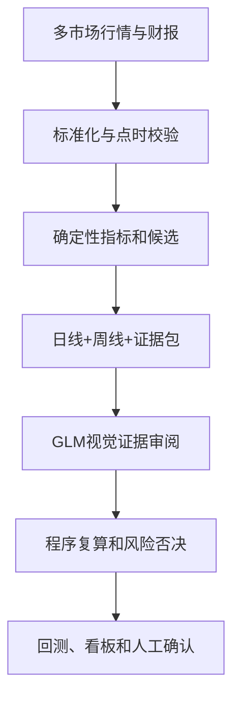

# StockTradebyZ v2 升级设计

## 结论

v2 不再让视觉模型从一张日线图直接决定推荐。完整链路改为：行情主备源交叉验证、点时基本面、确定性特征计算、日周双周期图、国产 GLM 强类型证据审阅、程序端风险否决与排序。



## 数据源路由

| 市场 | 主源 | 第二源 | 免费降级 | 基本面 |
|---|---|---|---|---|
| A股 | AKShare（便捷默认） | BaoStock、Tushare Pro | Futu OpenD | Tushare，按 `ann_date` 截断 |
| 港股 | Futu OpenD | 合规的付费全球数据商 | yfinance、AKShare | 免费降级源只允许当日研究；生产应接授权财报源或解析 HKEX 公告 |
| 美股 | Massive Stocks Advanced | Futu OpenD | yfinance | SEC EDGAR Company Facts，按 `filed` 截断 |

AKShare 聚合公开网站数据，适合研究补充和独立核对；上游页面变化可能破坏接口。yfinance 官方文档明确其未获 Yahoo 背书，面向研究/教育且数据用途受 Yahoo 条款约束。因此两者都不应成为唯一生产事实源。

当前默认 A 股日线抓取已改为 AKShare，运行主流程不需要 `TUSHARE_TOKEN`。
为了避免把当前网页快照错误用于历史回测，A 股点时基本面仍保留 Tushare
作为可选增强；未配置时模型会把基本面标记为缺失，而不会伪造验证结果。

Massive（原 Polygon 股票数据产品）当前免费层为 5 次/分钟、2 年历史和日终数据；若质量优先，美股使用 Advanced 的实时、20 年以上历史、公司行动、逐笔/报价和财务比率能力。

## 标准行情 Schema

所有 provider 输出统一字段：

```text
date, open, high, low, close, volume, turnover, adj_close,
currency, market, symbol, source, fetched_at
```

每次抓取同时写入：

- `data/lake/raw/...`：不可变原始快照，便于审计和复现；
- `data/lake/curated/bars/...`：去重后的标准 Parquet；
- `data/lake/quality/...`：主备源调用、质量检查和收益率差异；
- `data/raw/*.csv`：兼容现有 A 股 B1 选择器。

## AI 路由

默认主模型为国产 `glm-5v-turbo`，通过智谱的 OpenAI 兼容接口输入结构化证据、日线和周线；主模型不可用时自动降级到免费的 `glm-4.6v-flash`。JSON 模式输出仍须经过 Pydantic 强类型验证，最终分数与风险否决由程序计算。`gpt-5.6-sol` 保留为有额度时的高质量对照后端。

Gemini 保留为独立 A/B 对照，不再与核心流程耦合。RTX 4090 上的本地视觉模型适合全市场预筛、OCR 或云端故障降级，但最终候选仍由旗舰模型和确定性风控共同确认。

程序而非模型负责：

- 评分权重计算；
- `volume_behavior = 1` 一票否决；
- `distribution_risk` 一票否决；
- PASS/WATCH/FAIL 阈值；
- 数据过期、缺失和未来数据阻断；
- 排名、仓位上限及交易规则。

## 使用方法

多市场行情：

```bash
python -m pipeline.fetch_market CN:600519 HK:00700 US:AAPL --start 2024-01-01
```

点时基本面：

```bash
python -m pipeline.fetch_fundamentals CN:600519 US:AAPL --as-of 2026-07-20
```

原有 A 股全流程，默认使用国产 GLM：

```bash
python run_all.py
```

Gemini 对照运行：

```bash
python run_all.py --start-from 4 --reviewer gemini
```

## 上线验收

至少准备 200–500 个按时点冻结的历史样本，按时间做 purged walk-forward，而不是随机拆分。分别统计 A股、港股、美股以及上涨、震荡、下跌三类市场状态下的：

- Top 3/5/10 的 5、10、20 日超额收益；
- 命中率、最大回撤、换手率、滑点和交易成本；
- 风险股误入率及重大风险漏报率；
- 模型分数校准、重复运行一致性、结构化输出成功率；
- 数据源缺失率、主备源差异、延迟和修订频率；
- 模型、Prompt、数据快照和代码版本的完整可追溯性。

未经上述验收，模型分数只能作为研究标签，不能直接触发实盘订单。
